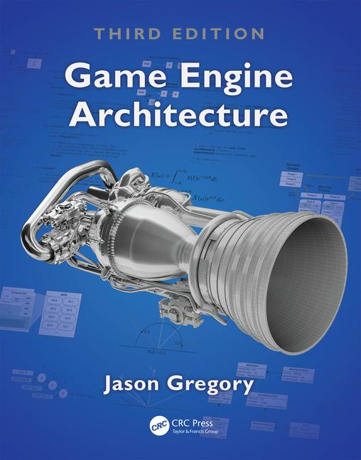

# CS425 Fall 2020: Game Programming 1

## Information
- Time: Monday and Wednesday, 12:00 pm - 1:15 pm (class will meet on BBCU with synchronous and asynchronous learning activities)
- Location: GMU Blackboard

- [Course HomePage](https://github.com/jmlien/CS425-2020)
- [Lecture schedule](lectures)
- [Programming assignments](assignments)
- [Discussion board](https://piazza.com/class/ke6j1cc6db6616)
- [Syllabus](https://cs.gmu.edu/media/syllabi/Fall2020/Game_Programming_1LienJ.html)

## Instructor

- [Jyh-Ming Lien](http://cs.gmu.edu/~jmlien)
- jmlien@cs.gmu.edu
- Office: Online
- Office hours: Mondays 12:00 pm - 1:00 pm and By Appointments

## Required Textbook

Game Engine Architecture by Jason Gregory. 3rd Edition. ISBN# 9781315267845.

Note: GMU students have full access to the [ebook](https://www-taylorfrancis-com.mutex.gmu.edu/books/9781315267845)

## Useful links
- http://soundbible.com/
- http://opengameart.org/
- http://www.google.com/fonts/
