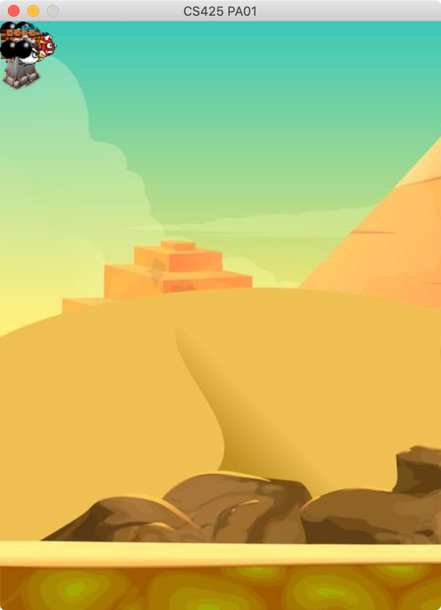
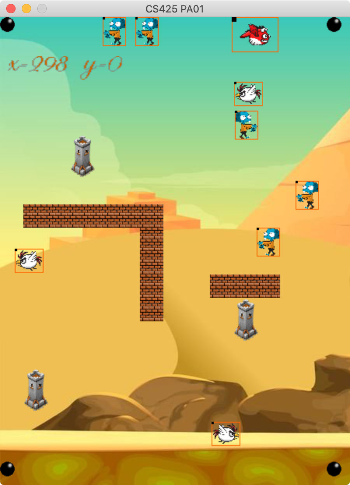

# Programming Assignment 01
Due: Sept 14th, 11:59pm, 2020

 

## Tasks

1. Compile/run the code using SDL2 and SDL2_image; you should see the left image above if everything works
    - On Linux/Mac/Linux
        - use cmake to compile: 
            > mkdir build; cd build; cmake ..; make
        - run the code: 
            > build/PA01 levels/level001.txt
    - On Windows using Visual studio (only in case that you have no clue how to compile the project)
        - Download [this zip file](https://www.dropbox.com/s/9zh5w84bjbdnfgf/netid-PA01.zip)
        - Unzip and rename netid-PA01.zip with your own GMU netid
        - Move eveything from this project (everything!) to your netid-PA01 folder
        - Open solution file PA01.sln in the folder "vcfiles" and then compile and run the code

2. Read the code and fix a small bug in MyScene.cpp so that all agents are placed in the correct locations (5 pts)
    - You should see the right image above if the bug is fixed
    - Hint: the bug is in the line with _agent->tranlateTo_ in the function _MyScene::create_

3. Implement MyScene::broad_range_collision in MyScene.cpp (10 pts)
    - This method detects all pairs of colliding agents
    - This method creates a user-defined SDL event for each pair of colliding agents

4. Create a subclass of MyAgent called MyZombieAgent so that the "z" agents can (20 pts)
    - Patrol back and forth horizontally. Patrol distance and speed: your choice 
    - Handle collision event: move in the opposite direction
    - Modify MyScene::create( std::istream & inputfile) so it creates MyZombieAgent (search for TODO in that function)

5. Create a subclass of MyAgent called MyChickenAgent so that the "c" agents can (20 pts)
   - Rotate about a point. Center, radius, direction (clockwise vs counter clockwise) of the rotation: your choice
   - Handle collision event: move in the opposite direction
   - Modify MyScene::create( std::istream & inputfile) so it creates MyChickenAgent 
    
6. Create a subclass of MyAgent called MyDragonAgent so that the "d" agent can (30 pts)
    - Handle arrow key events and move the agent accordingly
    - Implement display_HUD method and show its current location on the upper left corner of the screen
       - this will require SDL_ttf.h and SDL_ttf library installed
    - Handle collision event: Make the agent stop in place and ensure that the agent does not overlap with other objects and agents. 
    - Modify MyScene::create( std::istream & inputfile) so it creates MyDragonAgent 
    
7. Create a new level of size 50X50 inside the folder "levels" and call it **level003.txt** (10 pts)
    - You might need to adjust the windows size so that the screen fits the level 

8. Use http://fraps.com or other screen recording tool to record the "game play" (5 pts)

9. *Bonus points*: Implement a data structure for broad-range collision detection for Scene manager, it can be one of the following. 
    - Quadtree (15 pts)
    - KD-tree (20 pts)

## Related Tutorials

1. [SDL2 API](https://wiki.libsdl.org/APIByCategory)
2. [Lesson 11: Clip Rendering and Sprite Sheets](http://lazyfoo.net/tutorials/SDL/11_clip_rendering_and_sprite_sheets/index.php)
3. [Lesson 14: Animated Sprites and Vsync](http://lazyfoo.net/tutorials/SDL/14_animated_sprites_and_vsync/index.php)

## What to submit

1. Zip the entire folder with your new level and the video and name it your_net_id_PA01.zip
2. Upload the zip file to blackboard
3. Please state what Tasks and Bonus Points you have finished on the blackboard submission page. 
